# Exercise 7: Create a Dataflow (Gen2) in Microsoft Fabric

### Estimated Duration: 40 minutes

In Microsoft Fabric, Dataflows (Gen2) connect to various data sources and perform transformations in Power Query Online. They can then be used in Data Pipelines to ingest data into a lakehouse or other analytical store or to define a dataset for a Power BI report.

This lab is designed to introduce the different elements of Dataflows (Gen2), and not create a complex solution that may exist in an enterprise.

## Lab objectives

You will be able to complete the following tasks:

- Task 1: Create a Dataflow (Gen2) to ingest data
- Task 2: Add data destination for Dataflow
- Task 3: Add a dataflow to a pipeline

### Task 1: Create a Dataflow (Gen2) to ingest data

In this task, you will create a Dataflow (Gen2) to efficiently ingest and transform data from multiple sources for analysis. This process streamlines data preparation, enabling you to prepare the data for further processing and insights.

1. Navigate to your workspace named as **fabric-<inject key="DeploymentID" enableCopy="false"/> (1)** from the left navigation pane, click on **+ New item (2)** to create a Dataflow.

    

1. Search for **Dataflow Gen2 (1)** and select **Dataflow Gen2 (2)**.
Leave the name as default, **Uncheck (3)** the Enable Git integration, deployment pipelines and Public API scenarios, and then click on **Create (4)**.

   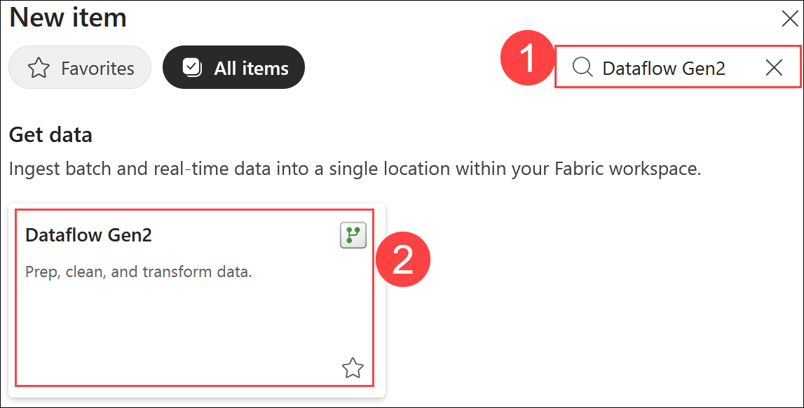

   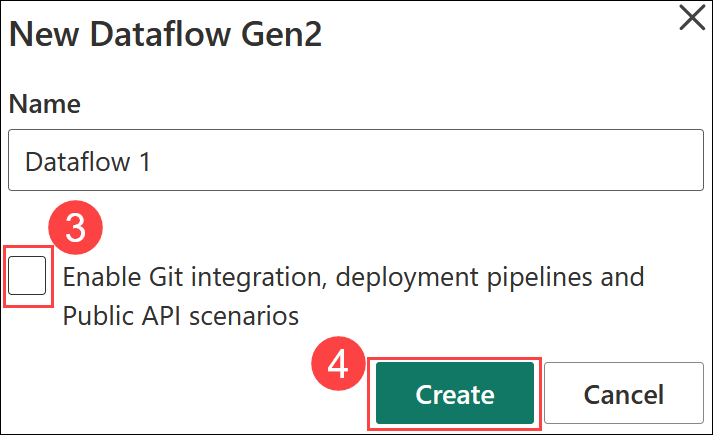

1. Select **Get data**, select **Test/CSV** and create a new data 1. 

   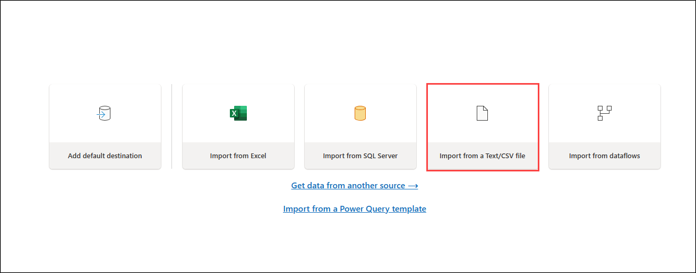

Create a new data source with the following settings:

   - **Link to file: (1)** Selected
   - **File path or URL: (2)** `https://raw.githubusercontent.com/MicrosoftLearning/dp-data/main/orders.csv`
   - **Connection: (3)** Create new connection
   - **Connection Name: (4)** Connection
   - **data gateway: (5)** (none)
   - **Authentication kind: (6)** Anonymous
   - **Privacy level: (7)** None
   - Click **Next (8)**

      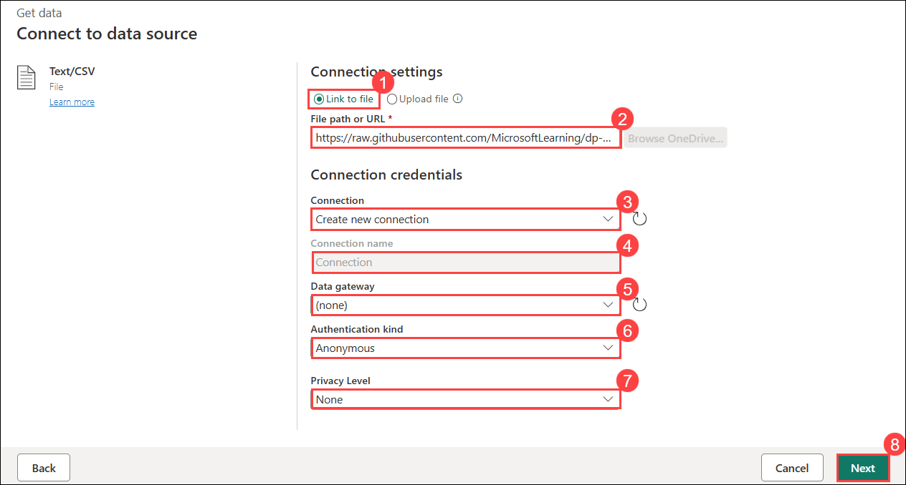

1. Preview the file data, and then **Create** the data source. The Power Query editor shows the data source and an initial set of query steps to format the data, as shown below:

   

1. Select the **Add column (1)** tab on the toolbar ribbon.Then, choose **Custom column (2)**.

   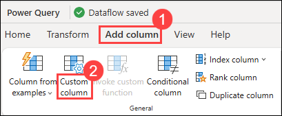

1. Now create a new column named **MonthNo (1)** using the formula `Date.Month([OrderDate])`**(2)**.And click on **OK (3)**.

   

1. The step to add the custom column is added to the query and the resulting column is displayed in the data pane:

   

### Task 2: Add data destination for Dataflow

In this task, you’ll add a data destination for the Dataflow to determine where the ingested and transformed data will be stored for future use.

1. From the bottom right corner, choose **Lakehouse** from the **Add data destination** drop-down menu.

   

   >**Note:** If this option is greyed out, you may already have a data destination set. Check the data destination at the bottom of the Query settings pane on the right side of the Power Query editor. If a destination is already set, you can change it using the gear.

2. In the **Connect to data destination** dialog box, make sure **Create a new connection (1)** is selected and the **<inject key="AzureAdUserEmail"></inject> (2)** account is signed in and then click on **Next (3)**.

   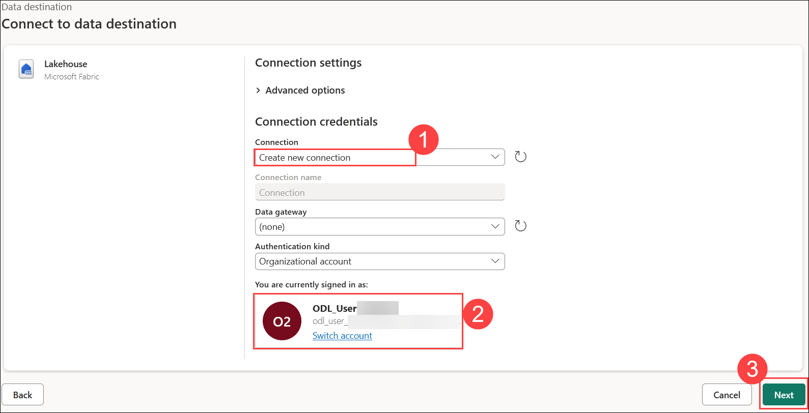

4. In the **Choose destination target** window, select the **fabric-<inject key="DeploymentID" enableCopy="false"/>** Workspace. Select the **fabric_lakehouse<inject key="DeploymentID" enableCopy="false"/> (1)** then specify the new table name as **orders (2)**, then click **Next (3)**.

   

5. On the Destination settings page, observe that **MonthNo** is not selected in the Column mapping, and an informational message is displayed.
 
6. On the Destination settings page, toggle **off (1)** the **Use Automatic Settings** option. Then, for the **MonthNo** column header, change the **Source Type** to **Whole number (2)**. Now, click on **Save settings (3)**.

    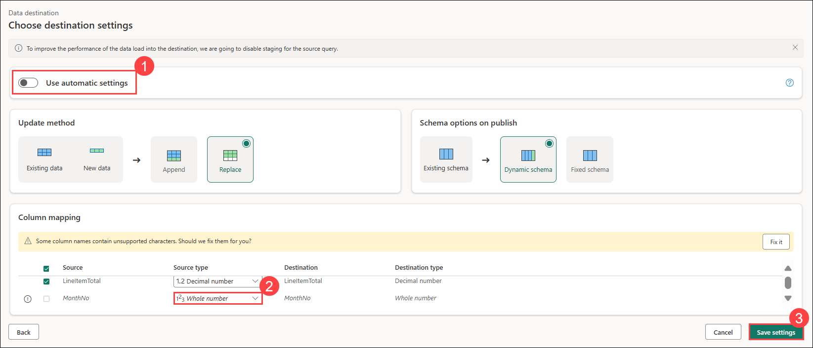

5. Click on the **Dataflow 2 (1)** on the top left, and rename the dataflow as **Transform Orders Dataflow (2)**.

   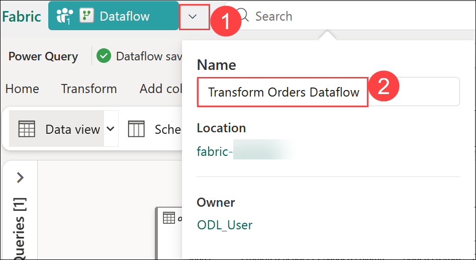

6. Select **Publish** from the bottom right corner to publish the dataflow. Then wait for the **Dataflow** to be created in the workspace.

   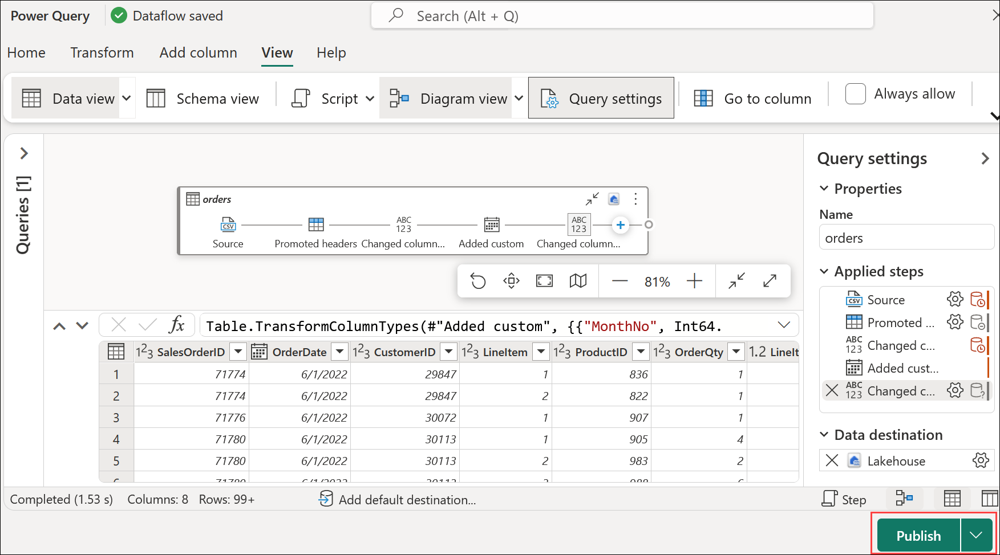

### Task 3: Add a dataflow to a pipeline

In this task, you’ll add a dataflow to a pipeline to streamline the data processing workflow and enable automated data transformations.

1. In the left pane, navigate to your **Workspace (1)** and click on **fabric-<inject key="DeploymentID" enableCopy="false"/> (1)**, then click on **+ New item (3)** to create a new **Data Flow Gen 2**.

    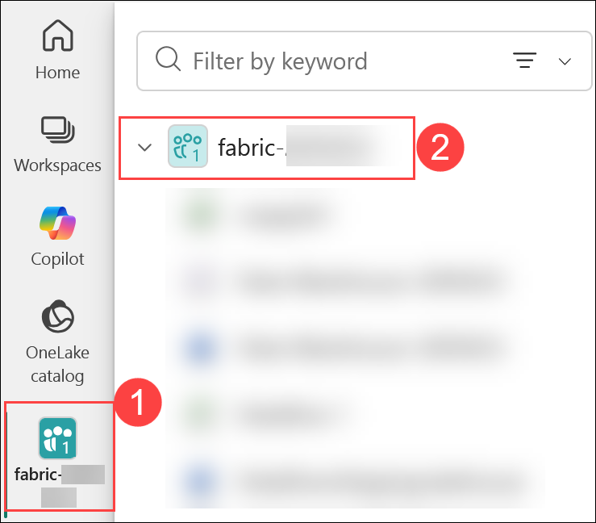

    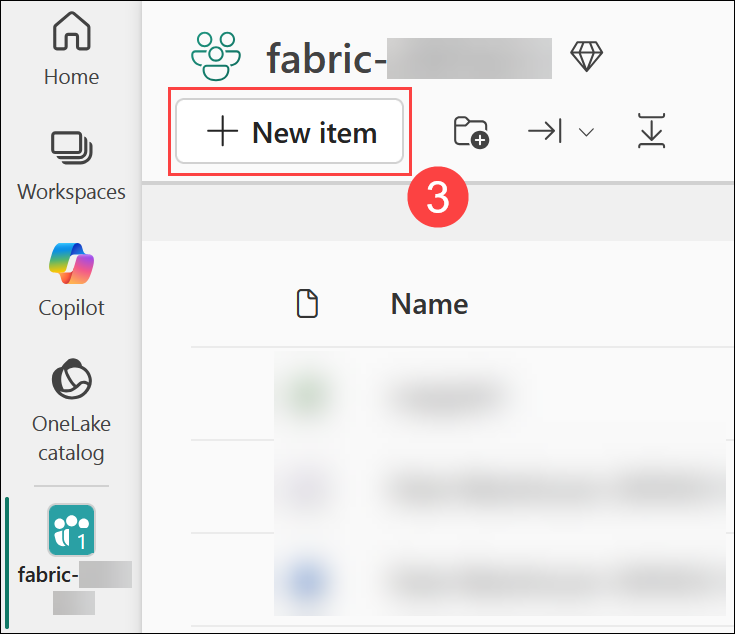

1. In the Search box, search for **Pipeline (1)**, and select **Pipeline (2)**.

   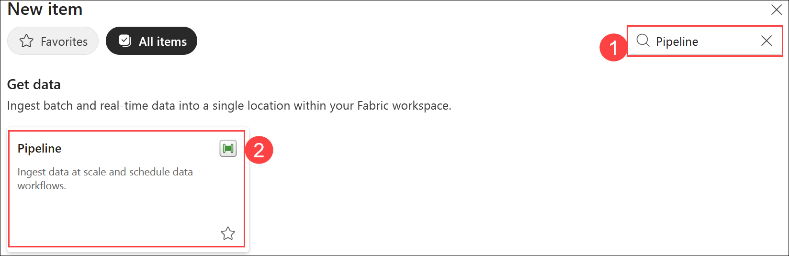

1. Set the Name as **Load Orders pipeline (1)** and click on **Create (2)**. This will open the pipeline editor.

   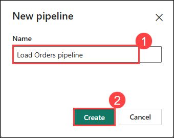

   > **Note:** If the Copy Data wizard opens automatically, close it!

1. Select **pipeline activity**, and add a **Dataflow** activity to the pipeline.

   

1. With the new **Dataflow1** activity selected, go to the **Settings (1)** tab which is at the bottom of the page. In the **Dataflow** drop-down list, choose **fabric-<inject key="DeploymentID" enableCopy="false"/>** or my workspace (2) and select **Transform Orders Dataflow (3)** 

   
   
1. **Save** the pipeline from the top left corner.

1. Use the **Run** button to run the pipeline, and wait for it to complete. It may take a few minutes.

   

1. In the menu bar on the left edge, select **fabric_lakehouse<inject key="DeploymentID" enableCopy="false"/>**

1. Expand the **Tables** section and select the **orders** table created by your dataflow.

   

   >**Note:** You might have to refresh the browser to get the expected output.

### Summary

In this exercise, you have created a Dataflow (Gen2) to ingest data , added data destination for Dataflow and a dataflow to a pipeline.

### You have successfully completed the lab

