# Exercise 8: Create a Dataflow (Gen2) in Microsoft Fabric

### Estimated Duration: 40 Minutes

## Overview

In this exercise, you'll explore data ingestion and transformation in Microsoft Fabric using Dataflow Gen2. You'll begin by creating a Dataflow to import and shape sales data using Power Query Online. Then, you'll define a lakehouse as the data destination, configure column mappings, and publish the Dataflow. Finally, you'll integrate the Dataflow into a pipeline to automate data processing and verify that the transformed data is successfully loaded into the lakehouse for future analysis.

## Lab objectives

You will be able to complete the following tasks:

- Task 1: Create a Dataflow (Gen2) to ingest data
- Task 2: Add data destination for Dataflow
- Task 3: Add a dataflow to a pipeline

## Task 1: Create a Dataflow (Gen2) to ingest data

In this task, you will create a Dataflow (Gen2) to efficiently ingest and transform data from multiple sources for analysis. This process streamlines data preparation, enabling you to prepare the data for further processing and insights.

1. In the left pane, navigate to your **Workspace (1)** and click on **fabric-<inject key="DeploymentID" enableCopy="false"/> (1)**, then click on **+ New item (3)** to create a new **Data Flow Gen 2**.

    

    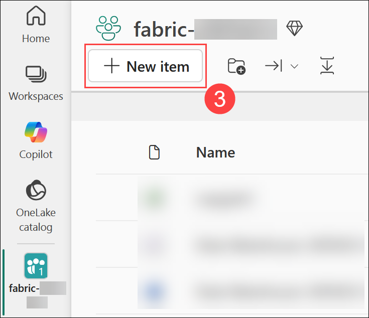

1. Search for **Dataflow Gen2 (1)** and select **Dataflow Gen2 (2)**. Leave the name as default, **Uncheck (3)** the **Enable Git integration, deployment pipelines and Public API scenarios**, and then click on **Create (4)**.

   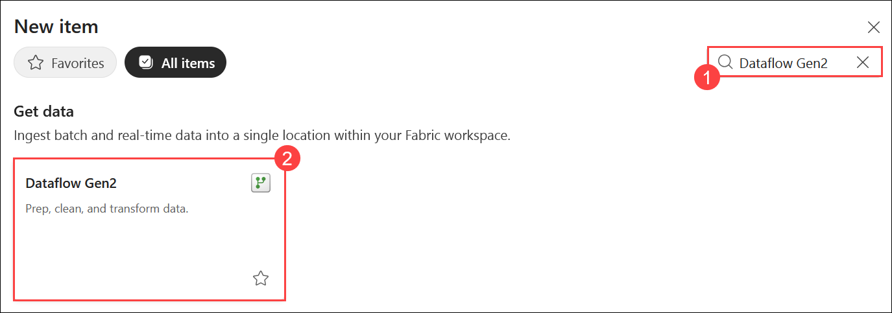

   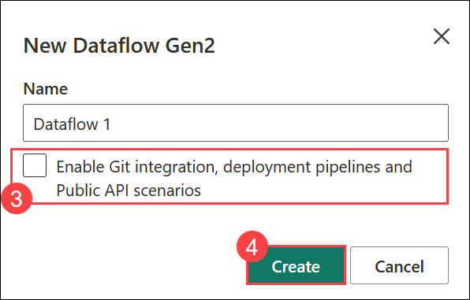

1. From the **Get data** pane, select **Import from a Text/CSV file**.

   

1. Create a new data source with the following settings:

    - **Link to file: (1)** Selected
    - **File path or URL: (2)** `https://raw.githubusercontent.com/MicrosoftLearning/dp-data/main/orders.csv`
    - **Connection: (3)** Create new connection
    - **Connection Name: (4)** Connection
    - **Data gateway: (5)** (none)
    - **Authentication kind: (6)** Anonymous
    - **Privacy level: (7)** None
    - Click **Next (8)**

      

1. Preview the file data, and then click **Create** the data source. The Power Query editor shows the data source and an initial set of query steps to format the data, as shown below:

   

1. Select the **Add column  (1)** tab on the toolbar ribbon. Then, choose **Custom column (2)** and create a new column with Name **MonthNo (3)** and enter the formula **Date.Month([OrderDate]) (4)** in the **Custom column formula** box and then click **OK (5)**.

   

   

1. The step to add the custom column is added to the query, and the resulting column is displayed in the data pane:

   

1. Duplicate the current window. From the left pane, click on **fabric-<inject key="DeploymentID" enableCopy="false"/> (1)** and select **fabric_lakehouse<inject key="DeploymentID" enableCopy="false"/> (1)** Lakehouse. 

   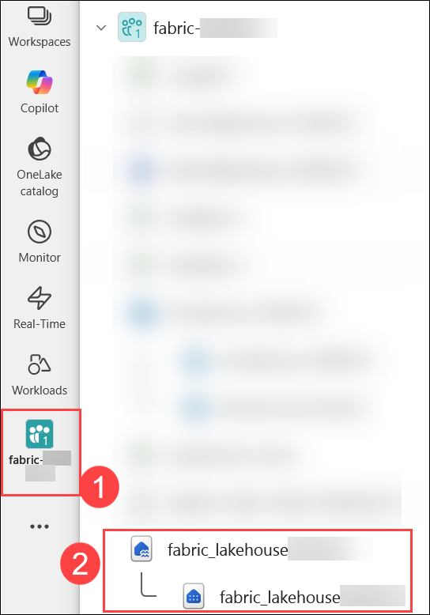

1. Hover on **orders (1)** file and click on the **Ellipsis (...)**, and then select **Delete (2)**.

   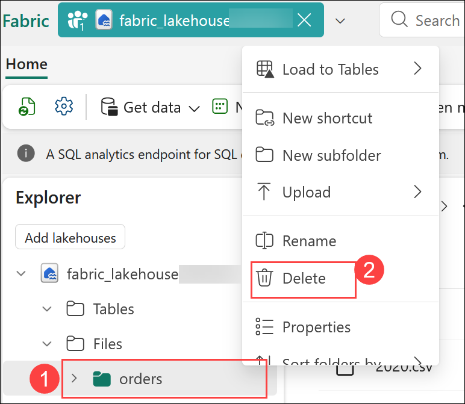

1. Click on **Delete** for the pop-up **Delete "orders"?**

   

## Task 2: Add data destination for Dataflow

In this task, you’ll add a data destination for the Dataflow to determine where the ingested and transformed data will be stored for future use.

1. Switch to your Dataflow window. In the **Query settings** in the right pane, click on **+ (1)** for Data Destination, then choose **Lakehouse (2)** from the menu.

   

   >**Note:** If the Query settings pane isn't visible, go to the top ribbon, select **Query (1)**, then click **Add data destination (2)** and choose **Lakehouse (3)**.

   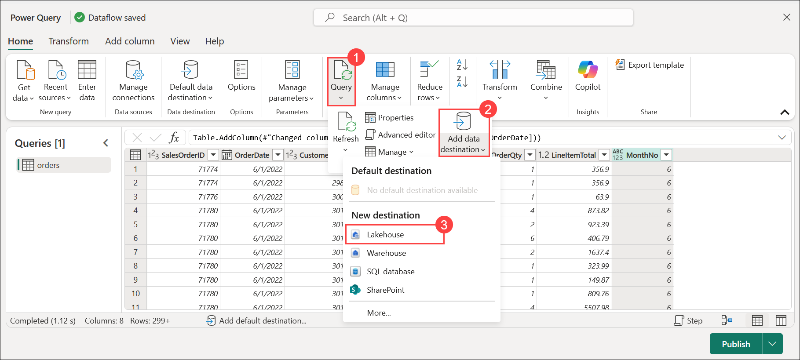

   >**Note:** If this option is greyed out, you may already have a data destination set. Check the data destination at the bottom of the Query settings pane on the right side of the Power Query editor. If a destination is already set, you can change it using the gear.

1. In the **Connect to data destination** dialog box, make sure **Create a new connection (1)** is selected and the **<inject key="AzureAdUserEmail"></inject> (2)** account is signed in and then click on **Next (3)**.

   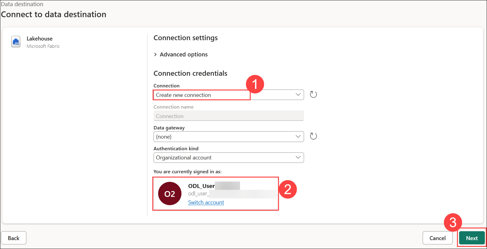

1. In the **Choose destination target** window, select the **fabric-<inject key="DeploymentID" enableCopy="false"/>** Workspace. Select the **fabric_lakehouse<inject key="DeploymentID" enableCopy="false"/> (1)** then specify the new table name as **orders (2)**, then click **Next (3)**.

   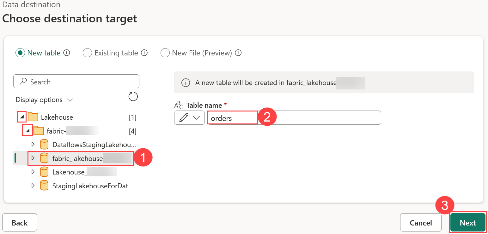

1. On the Destination settings page, observe that **MonthNo** is not selected in the Column mapping, and an informational message is displayed.
 
1. On the Destination settings page, toggle **off (1)** the **Use Automatic Settings** option. Then, for the **MonthNo** column header, change the **Source Type** to **Whole number (2)**. Now, click on **Save settings (3)**.
   
   

1. Click on the **Dataflow 2 (1)** on the top left, and rename the dataflow as **Transform Orders Dataflow (2)**.

   

1. Select **Publish** from the bottom right corner to publish the dataflow. Then wait for the **Dataflow** to be created in the workspace.

   

## Task 3: Add a dataflow to a pipeline

In this task, you’ll add a dataflow to a pipeline to streamline the data processing workflow and enable automated data transformations.

1. In the left pane, navigate to your **Workspace (1)** and click on **fabric-<inject key="DeploymentID" enableCopy="false"/> (1)**, then click on **+ New item (3)**.

    

    

1. In the Search box, search for **Pipeline (1)**, and select **Pipeline (2)**.

   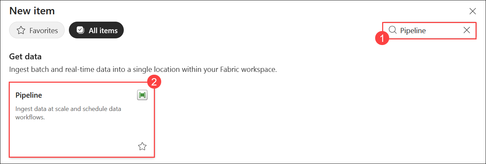

1. Set the Name as **Load Orders pipeline (1)** and click on **Create (2)**. This will open the pipeline editor.

   

   > **Note:** If the Copy Data wizard opens automatically, close it!

1. In the **Build a data pipeline to organize and move your data** window, click on **Pipeline activity (1)**, and select **Dataflow (2)** activity to the pipeline.

   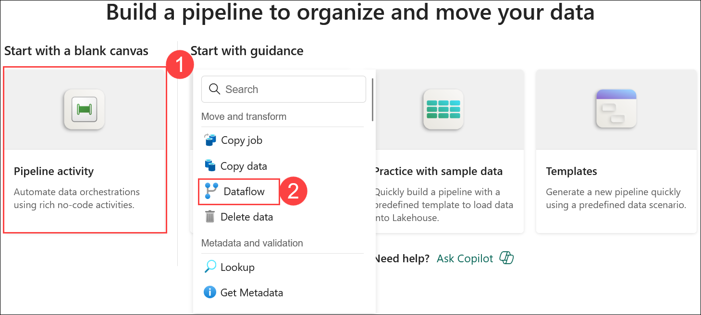

1. With the new **Dataflow1** activity selected, go to the **Settings (1)** tab in the bottom. In the **Workspace** drop-down list, choose **fabric-<inject key="DeploymentID" enableCopy="false"/> (2)** and in the **Dataflow** drop-down list, select **Transform Orders Dataflow (3)** (the data flow you created previously).

   
   
1. Select **Save** from the top-left corner to save the pipeline.

   

1. Use the **Run** button to run the pipeline, and wait for it to complete. It may take a few minutes.

   
   
   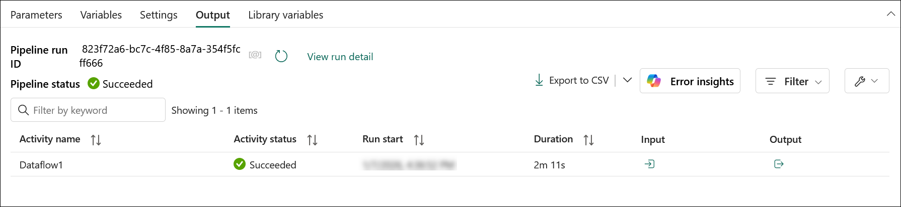

1. Navigate to your **fabric_lakehouse<inject key="DeploymentID" enableCopy="false"/>** Lakehouse.

1. Expand the **Tables** section and select the **orders** table created by your dataflow.

   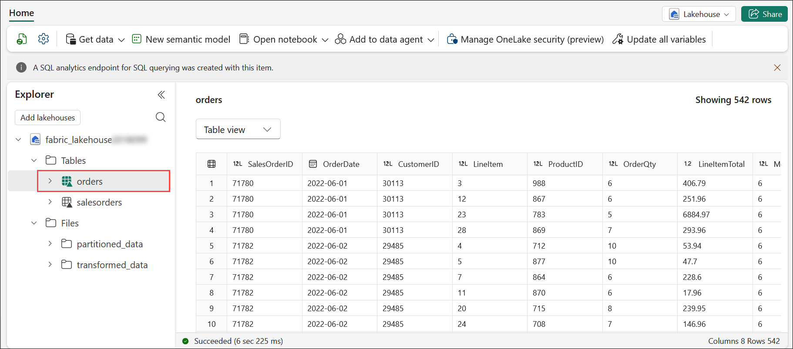

   >**Note:** You might have to refresh the browser to get the expected output.

## Summary

In this exercise, you:

- Created a **Dataflow (Gen2)** to ingest and prepare data.
- Added a **data destination** to store the output of the Dataflow.
- Integrated the **Dataflow into a pipeline** for automated data processing.

### Conclusion

Congratulations on completing this lab. By completing this lab, you’ve gained hands-on experience across key components of **Microsoft Fabric**, from setting up collaborative **workspaces** to ingesting, transforming, and analyzing data using tools like **Dataflows**, **Pipelines**, **Notebooks**, **Copilot**, and **Apache Spark**. You explored data in real time with **KQL**, built and queried **Data warehouses**, trained machine learning models, and leveraged **Copilot** for advanced analytics and automation. These exercises collectively strengthen your skills in modern **data engineering**, **analytics**, and **AI-driven workflows**, preparing you to build scalable, efficient, and intelligent data solutions within Microsoft Fabric.

### You have successfully completed the Hands-on lab!
