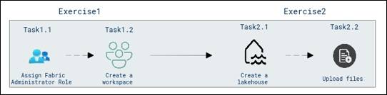

# Cloud Scale Analytics with Microsoft Fabric

### Overall Estimated Duration : **30 Minutes**

## Overview

Microsoft Fabric is a unified data platform that combines data engineering, data warehousing, and business intelligence tools into a cohesive environment. By leveraging Microsoft Fabric, you can effectively manage, analyze, and visualize large datasets, analyze, and visualize large datasets, enabling powerful data-driven decision-making processes.

In this lab, you will create dedicated workspaces and work with Lakehouse storage to upload and organize data files. Microsoft Fabric serves as a comprehensive analytics platform, streamlining workflows by integrating data engineering, data warehousing, and business intelligence capabilities. Here, you can create dedicated workspaces and work with Lakehouse storage to upload and organize data files.

## Objective

In this lab, you will:

- Create and configure a Microsoft Fabric workspace
- Assign the Fabric Administrator role
- Create a Lakehouse for structured data storage
- Upload files for analysis

## Prerequisites

Participants should have:

- **Basic Knowledge of Microsoft Azure**: Familiarity with the Azure portal and the process of role assignments within Azure Active Directory (Entra ID).
- **Understanding of Workspace creation**: Familiarity with the concept of workspaces in cloud platforms and how to create and configure them.
- **Basic Knowledge of cloud data storage**: Understanding the concept of Lakehouses for organizing and storing data in cloud environments.
- **Basic file management skills**: Ability to upload files into a cloud-based data platform like Microsoft Fabric for further analysis.

## Architecture

The lab architecture involves a structured flow where a Fabric Administrator Role is assigned to manage the Fabric environment, ensuring that all resources and permissions are properly handled. A Fabric Workspace is established to provide a dedicated area for organizing and managing resources, enhancing workflow efficiency. Data is centralized in a Lakehouse, designed to handle large-scale data storage, making it easy to store and access for analysis. The File Upload Process is implemented to streamline the uploading and organizing of data within the Lakehouse, ensuring that data is easily accessible and ready for efficient processing and analysis. This integrated flow supports effective resource management, data storage, and analysis.   

## Architecture Diagram 

## Explanation of Components

The architecture for this lab involves the following key components:

- **Fabric Administrator Role:** Ensures that the necessary permissions are granted to manage the workspace effectively, enabling access control and administrative capabilities.

- **Workspace:** A central environment where data and resources are managed. The workspace acts as the foundation for organizing and collaborating on data storage and analysis tasks.

- **Lakehouse:** A data storage solution designed for structured and unstructured data. The Lakehouse enables efficient data organization and facilitates analysis tasks.

- **Data Ingestion Tools:** Enables the uploading of files into the Lakehouse to populate datasets required for analysis and querying.

## Getting Started with the Lab 

Once you begin, your virtual machine and lab guide will be available directly within your web browser.

 

## Virtual Machine & Lab Guide

In the integrated environment, the lab VM serves as the designated workspace, while the lab guide is accessible on the right side of the screen.

**Note**: Kindly ensure that you are following the instructions carefully to ensure the lab runs smoothly and provides an optimal user experience.

## Exploring Your Lab Resources

To get a better understanding of your lab resources and credentials, navigate to the **Environment** tab.

   
## Utilizing the Split Window Feature
 
For convenience, you can open the lab guide in a separate window by selecting the **Split Window** button from the top-right corner.
 
 

## Lab Guide Zoom In/Zoom Out
 
To adjust the zoom level, select the **A↕ (1)** icon next to the timer, and then choose the required **zoom percentage (2)** from the dropdown.

  

## Managing Your Virtual Machine

Feel free to start, stop, or restart your virtual machine by selecting **More (1)**, choosing **Resources (2)**, and using the available **VM actions (3)** to manage your lab environment as needed.

  
## Let's Get Started with Azure Portal

1. On your virtual machine, click on the Azure Portal icon as shown below:

   
   
1. You'll see the **Sign into Microsoft Azure** tab. Here, enter your credentials:
 
   - **Email (1):** <inject key="AzureAdUserEmail"></inject>

   - Click **Next (2)**.
 
      
 
1. Next, provide your **Enter Temporary Access Pass**:
 
   - **Password (1):** <inject key="AzureAdUserPassword"></inject>

   - click **Sign in (2)**.
 
      

1. If **Action Required** window pop up click on **Ask later**.
 
1. If prompted to stay signed in, click "No."

1. If you see the pop-up **Sign in to sync data**, Click **No,thanks.** 

1. If you see the pop-up **You have free Azure Advisor recommendations!**, close the window to continue the lab.

1. If a **Welcome to Microsoft Azure** popup window appears, click **Cancel** to skip the tour.

## Support Contact
 
The CloudLabs support team is available 24/7, 365 days a year, via email and live chat to ensure seamless assistance at any time. We offer dedicated support channels tailored specifically for both learners and instructors, ensuring that all your needs are promptly and efficiently addressed.

Learner Support Contacts:
- Email Support: cloudlabs-support@spektrasystems.com
- Live Chat Support: https://cloudlabs.ai/labs-support

Now, click on **Next** from the lower right corner to move on to the next page. 

 

### Happy Learning!!
