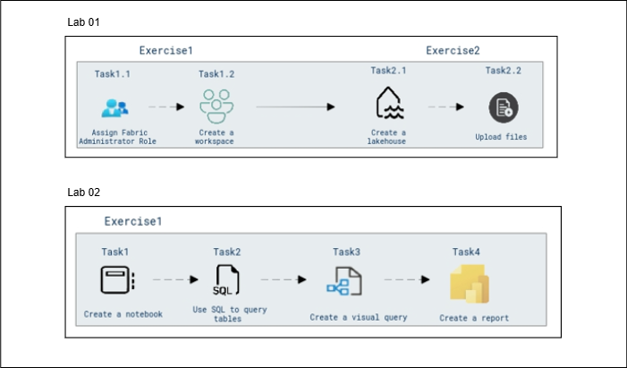

# Cloud Scale Analytics with Microsoft Fabric

### Overall Estimated Duration : **90 Minutes**

## Overview

Microsoft Fabric is a unified data platform that combines data engineering, data warehousing, and business intelligence tools into a cohesive environment. By leveraging Microsoft Fabric, organizations can effectively manage, analyze, and visualize large datasets, enabling powerful data-driven decision-making processes.

In this hands-on experience, you will explore how to use Microsoft Fabric to set up a centralized data workspace, ingest and transform data, and utilize Power BI for reporting and analysis. You will begin by configuring your Fabric workspace and Lakehouse to store data efficiently, then move on to ingesting and transforming data using notebooks. With SQL queries, you’ll analyze the data and create compelling, interactive reports in Power BI to uncover valuable insights.

## Objective

Learn to leverage Microsoft Fabric and Power BI to manage, transform, and analyze data within a unified data platform. This experience will guide you through the process of setting up a centralized data workspace, ingesting and transforming data, and creating interactive reports for actionable insights.

- **Getting Started with Microsoft Fabric:** Learn how to create and manage a workspace in Microsoft Fabric by assigning the Fabric Administrator role, setting up a new workspace for data and analytics projects, and organizing your work effectively. Additionally, gain hands-on experience in setting up a Lakehouse within the workspace and uploading data files (e.g., CSV) to the Lakehouse, laying the foundation for future data analysis and processing.

- **Ingest Data with a Microsoft Fabric Lakehouse:** Learn how to ingest data into a Microsoft Fabric Lakehouse using notebooks and SQL, process and transform the data with PySpark, and save the results as managed tables. Additionally, use SQL queries and visual queries in Power BI to analyze and visualize the data, creating comprehensive reports that provide meaningful insights and enhance data accessibility for further analysis.

## Prerequisites

Participants should have:

- **Basic Knowledge of Microsoft Azure**: Familiarity with the Azure portal and the process of role assignments within Azure Active Directory (Entra ID).
- **Understanding of Workspace Creation**: Familiarity with the concept of workspaces in cloud platforms and how to create and configure them.
- **Basic Knowledge of Cloud Data Storage**: Understanding the concept of Lakehouses for organizing and storing data in cloud environments.
- **Basic File Management Skills**: Ability to upload files into a cloud-based data platform like Microsoft Fabric for further analysis.
- **Proficiency in Python and SQL:** Experience with Python for data processing (using PySpark) and SQL for querying databases.
- **Familiarity with Data Transformation Tools:** Understanding of tools like notebooks in Microsoft Fabric to process and transform data.
- **Experience with Power BI:** Knowledge of using Power BI for creating visualizations and reports from ingested data.
- **Basic Understanding of Data Warehousing Concepts:** Familiarity with Lakehouse architecture and managed tables within cloud-based environments like Microsoft Fabric.

## Architecture

The architecture leverages Microsoft Fabric to create and manage a streamlined data environment involving workspaces, lakehouses, notebooks, and reporting tools. The first lab focuses on foundational setup, starting with assigning the Fabric Administrator Role, creating a workspace, setting up a lakehouse for data storage, and uploading files for analysis. The second lab builds on this by creating a notebook for data exploration, querying data using SQL, generating visual queries, and creating reports to summarize insights. This flow ensures a seamless transition from data ingestion to analysis and reporting, enabling efficient data management and actionable insights.

## Architecture Diagram

## Explanation of Components

### Lab 01 Components:

- **Fabric Administrator Role:** Ensures that the necessary permissions are granted to manage the workspace effectively, enabling access control and administrative capabilities.

- **Workspace:** A central environment where data and resources are managed. The workspace acts as the foundation for organizing and collaborating on data storage and analysis tasks.

- **Lakehouse:** A data storage solution designed for structured and unstructured data. The Lakehouse enables efficient data organization and facilitates analysis tasks.

- **Data Ingestion Tools:** Enables uploading of files into the Lakehouse to populate datasets required for analysis and querying.

### Lab 02 Components:

- **Notebook:** A collaborative environment for writing and executing code. Notebooks are used to explore and analyze data interactively.

- **SQL Query Engine:** Facilitates structured querying of stored data, extracting insights directly from tables for analysis..

- **Visual Query Tools:** Translates SQL results into visual representations, making data trends and patterns easier to understand.

- **Report Builder:** Compiles data insights into a structured and shareable format, providing a comprehensive view of the analyzed information.

## Getting Started with the Lab 

Once you're ready to dive in, your virtual machine and lab guide will be right at your fingertips within your web browser.

 

## Virtual Machine & Lab Guide

In the integrated environment, the lab VM serves as the designated workspace, while the lab guide is accessible on the right side of the screen.

**Note**: Kindly ensure that you are following the instructions carefully to ensure the lab runs smoothly and provides an optimal user experience.

## Exploring Your Lab Resources

To get a better understanding of your lab resources and credentials, navigate to the **Environment** tab.

   
## Utilizing the Split Window Feature
 
For convenience, you can open the lab guide in a separate window by selecting the **Split Window** button from the Top right corner.
 
 

## Lab Guide Zoom In/Zoom Out
 
To adjust the zoom level, select the **A↕ (1)** icon next to the timer, and then choose the required **zoom percentage (2)** from the dropdown.

  

## Managing Your Virtual Machine

Feel free to start, stop, or restart your virtual machine by selecting **More (1)**, choosing **Resources (2)**, and using the available **VM actions (3)** to manage your lab environment as needed.

  
## Let's Get Started with Azure Portal

1. On your virtual machine, click on the Azure Portal icon as shown below:

   
   
1. You'll see the **Sign into Microsoft Azure** tab. Here, enter your credentials:
 
   - **Email (1):** <inject key="AzureAdUserEmail"></inject>

   - click **Next (2)**.
 
      
 
1. Next, provide your **Enter Temporary Access Pass**:
 
   - **Password (1):** <inject key="AzureAdUserPassword"></inject>

   - click **Sign in (2)**.
 
      

1. If **Action Required** window pop up click on **Ask later**.
 
1. If prompted to stay signed in, you can click "No."

1. If you see the pop-up **Sign in to sync data**, Click on **No,thanks.** 

1. If you see the pop-up **You have free Azure Advisor recommendations!**, close the window to continue the lab.

1. If a **Welcome to Microsoft Azure** popup window appears, click **Cancel** to skip the tour.

## Support Contact
 
The CloudLabs support team is available 24/7, 365 days a year, via email and live chat to ensure seamless assistance at any time. We offer dedicated support channels tailored specifically for both learners and instructors, ensuring that all your needs are promptly and efficiently addressed.

Learner Support Contacts:
- Email Support: cloudlabs-support@spektrasystems.com
- Live Chat Support: https://cloudlabs.ai/labs-support

Now, click on **Next** from the lower right corner to move on to the next page. 

 

### Happy Learning!!
