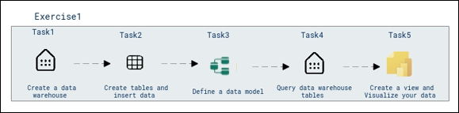
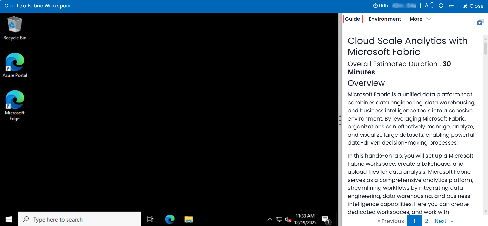
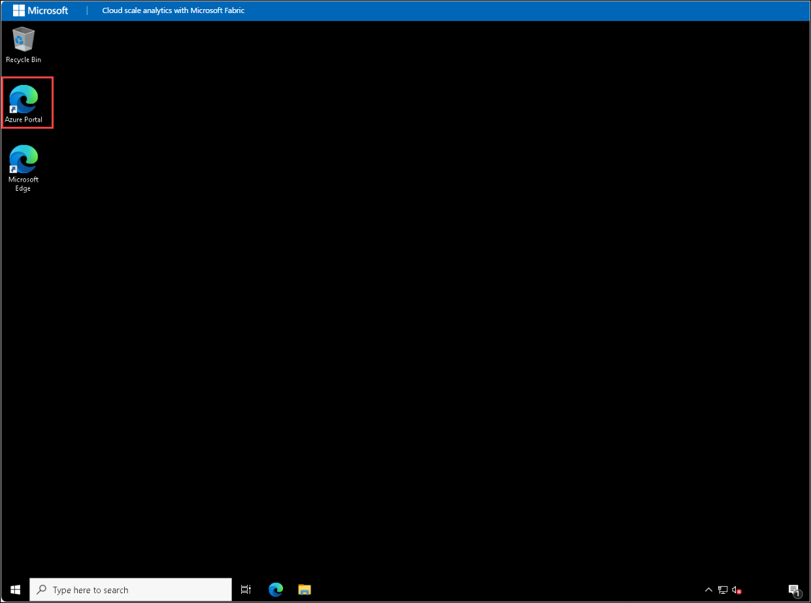
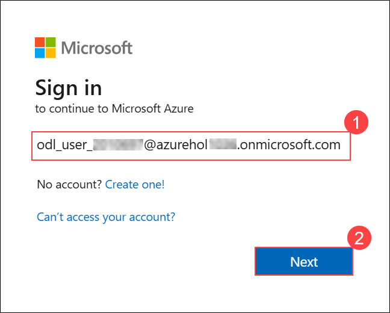
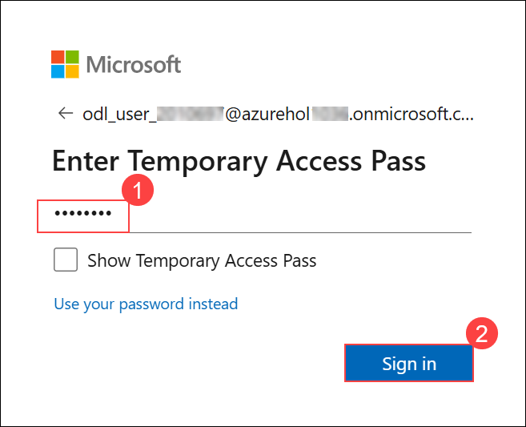

# **Cloud Scale Analytics with Microsoft Fabric**

### Overall Estimated Duration: **120 minutes**  

## **Overview**  
In **Microsoft Fabric**, a data warehouse provides a relational database designed for large-scale analytics. Unlike the default read-only SQL endpoint for tables defined in a lakehouse, a data warehouse supports full SQL semantics, including the ability to insert, update, and delete data in tables.  

In this lab, you will dive into the world of data analysis within a data warehouse using **Power BI**.

## **Objective**  

**Analyze Data in a Data Warehouse:** Utilize Microsoft Fabric to build and analyze data in a data warehouse. In this lab, you will learn to create a data warehouse, define data models, query data using SQL, and generate insights. You will also create views and use Power BI to visualize data, enabling advanced reporting and interactive dashboards for data-driven decision-making.

## **Prerequisites**  

You should have:  
- **Basic Understanding of Relational Databases:** Familiarity with SQL and database concepts.  

- **Proficiency in Power BI:** Experience creating visualizations and analyzing data with Power BI.  
- **Basic knowledge of Microsoft Fabric:** Understanding of the components and structure of Microsoft Fabric.  
- **Basic data modeling skills:** Ability to define relationships and optimize data for analysis.  

## **Architecture**  

The architecture for this lab illustrates how Microsoft Fabric integrates with a data warehouse and Power BI to create a seamless data analysis experience. The data warehouse serves as the central repository for large-scale analytics, offering robust SQL capabilities. Using Microsoft Fabric, you can manage and scale the data warehouse while defining relationships and data models to ensure efficiency. Power BI acts as the visualization layer, providing an interactive interface to explore, analyze, and present data insights.

### **Architecture Diagram**  
   
---

## **Explanation of Components**  

The architecture for this lab involves the following key components:
-  **Create a Data Warehouse**
You will set up a data warehouse in Microsoft Fabric, learning the process of creating a scalable relational database designed for large-scale data analytics and reporting.

- **Create Tables and Insert Data**
You will create tables within the data warehouse, define their schema, and insert sample data to prepare for analysis, gaining hands-on experience in data organization.

- **Define a Data Model**
You will define relationships between tables to optimize the data for querying and analysis, using techniques like normalization to ensure data integrity and efficiency.

- **Query Data Warehouse Tables**
You will write and execute SQL queries to retrieve and manipulate data, using commands like SELECT, JOIN, and WHERE to filter and aggregate data for analysis.

- **Create a View and Visualize Your Data** 
You will create views to simplify querying and use Power BI to visualize data, building interactive dashboards and reports for insights and decision-making. 

## Getting Started with the Lab 

Once you're ready to dive in, your virtual machine and lab guide will be right at your fingertips within your web browser.

 

## Virtual Machine & Lab Guide

In the integrated environment, the lab VM serves as the designated workspace, while the lab guide is accessible on the right side of the screen.

**Note**: Kindly ensure that you are following the instructions carefully to ensure the lab runs smoothly and provides an optimal user experience.

## Exploring Your Lab Resources

To get a better understanding of your lab resources and credentials, navigate to the **Environment** tab.

   
## Utilizing the Split Window Feature
 
For convenience, you can open the lab guide in a separate window by selecting the **Split Window** button from the Top right corner.
 
 

## Lab Guide Zoom In/Zoom Out
 
To adjust the zoom level, select the **A↕ (1)** icon next to the timer, and then choose the required **zoom percentage (2)** from the dropdown.

  

## Managing Your Virtual Machine

Feel free to start, stop, or restart your virtual machine by selecting **More (1)**, choosing **Resources (2)**, and using the available **VM actions (3)** to manage your lab environment as needed.

  
## Let's Get Started with Azure Portal

1. On your virtual machine, click on the Azure Portal icon as shown below:

   
   
1. You'll see the **Sign into Microsoft Azure** tab. Here, enter your credentials:
 
   - **Email (1):** <inject key="AzureAdUserEmail"></inject>

   - click **Next (2)**.
 
      
 
1. Next, provide your **Enter Temporary Access Pass**:
 
   - **Password (1):** <inject key="AzureAdUserPassword"></inject>

   - click **Sign in (2)**.
 
      

1. If **Action Required** window pop up click on **Ask later**.
 
1. If prompted to stay signed in, you can click "No."

1. If you see the pop-up **Sign in to sync data**, Click on **No,thanks.** 

1. If you see the pop-up **You have free Azure Advisor recommendations!**, close the window to continue the lab.

1. If a **Welcome to Microsoft Azure** popup window appears, click **Cancel** to skip the tour.

## Support Contact
 
The CloudLabs support team is available 24/7, 365 days a year, via email and live chat to ensure seamless assistance at any time. We offer dedicated support channels tailored specifically for both learners and instructors, ensuring that all your needs are promptly and efficiently addressed.

Learner Support Contacts:
- Email Support: cloudlabs-support@spektrasystems.com
- Live Chat Support: https://cloudlabs.ai/labs-support

Now, click on **Next** from the lower right corner to move on to the next page. 

 

### Happy Learning!!