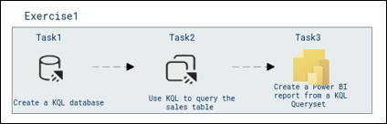

# **Cloud Scale Analytics with Microsoft Fabric**

### Overall Estimated Duration: **60 minutes**  

## **Overview**  
**Microsoft Fabric** offers a robust runtime designed for storing and querying data using Kusto Query Language (KQL), which is particularly optimized for time series data, such as real-time logs and IoT device streams. This lab provides an engaging introduction to the capabilities of **KQL**, guiding you through the process of creating a KQL database, performing **data queries**, and **visualizing insights** with **Power BI reports**. By exploring the exciting realm of real-time analytics, you will gain hands-on experience with Microsoft Fabric's powerful tools and learn how to harness KQL for dynamic data analysis and reporting.

## **Objective**  

**Get Started with Real-Time Analytics in Microsoft Fabric:** The objective of the lab,  is to introduce you to the powerful capabilities of Microsoft Fabric and Kusto Query Language (KQL) for real-time analytics. You will learn how to create a KQL database, query time-series data efficiently, and develop compelling Power BI reports. By the end of this lab, you will have hands-on experience leveraging Microsoft Fabric to analyze real-time data, such as log files and IoT device streams, and transform insights into actionable visualizations.

## **Prerequisites**  

Participants should have:  
- **Basic Understanding of KQL:** Familiarity with Kusto Query Language and querying structured data.  

- **Experience with Microsoft Fabric:** General understanding of the Microsoft Fabric environment and its components. 

- **Proficiency in Power BI:** Basic experience in creating and customizing visualizations using Power BI.  

- **Knowledge of Real-Time Data Concepts:** Understanding of time-series data and its applications, such as log files and IoT streams.

## **Architecture**  

The architecture illustrates the workflow for Exercise 1 of the lab, showcasing a three-step process. The first step involves creating a KQL database in Microsoft Fabric, which acts as the foundational storage for time-series or structured data. Once the database is set up, the next step is to use Kusto Query Language (KQL) to query the "Sales" table, retrieving and analyzing data based on specific criteria. Finally, the results of the KQL query are used to create a dynamic Power BI report, enabling visualization and actionable insights. This flow demonstrates the seamless integration of Microsoft Fabric, KQL, and Power BI to perform real-time analytics effectively.

### **Architecture Diagram**  
   
---

## **Explanation of Components**  

The architecture for this lab involves the following key components:
-  **Create a KQL Database:**
In this step, you created a KQL database to store and manage your data. This database serves as the foundation for querying and analyzing data using Kusto Query Language (KQL). The database structure was designed to efficiently organize sales data for further analysis.

- **Use KQL to Query the Sales Table:**
With KQL, you wrote queries to interact with the sales table, filtering and aggregating data to derive meaningful insights. By using various operators and functions, you calculated key metrics, such as total revenue and product-wise sales, enabling more precise data analysis.

- **Create a Power BI Report from a KQL Queryset:**
Using the results from your KQL query, you created a Power BI report that visualizes the data. The report was customized with charts and tables to display the insights clearly, allowing stakeholders to easily interpret and make data-driven decisions based on the sales information.

## Getting Started with the Lab 

Once you're ready to dive in, your virtual machine and lab guide will be right at your fingertips within your web browser.

 

## Virtual Machine & Lab Guide

In the integrated environment, the lab VM serves as the designated workspace, while the lab guide is accessible on the right side of the screen.

**Note**: Kindly ensure that you are following the instructions carefully to ensure the lab runs smoothly and provides an optimal user experience.

## Exploring Your Lab Resources

To get a better understanding of your lab resources and credentials, navigate to the **Environment** tab.

   
## Utilizing the Split Window Feature
 
For convenience, you can open the lab guide in a separate window by selecting the **Split Window** button from the Top right corner.
 
 

## Lab Guide Zoom In/Zoom Out
 
To adjust the zoom level, select the **A↕ (1)** icon next to the timer, and then choose the required **zoom percentage (2)** from the dropdown.

  

## Managing Your Virtual Machine

Feel free to start, stop, or restart your virtual machine by selecting **More (1)**, choosing **Resources (2)**, and using the available **VM actions (3)** to manage your lab environment as needed.

  
## Let's Get Started with Azure Portal

1. On your virtual machine, click on the Azure Portal icon as shown below:

   
   
1. You'll see the **Sign into Microsoft Azure** tab. Here, enter your credentials:
 
   - **Email (1):** <inject key="AzureAdUserEmail"></inject>

   - click **Next (2)**.
 
      
 
1. Next, provide your **Enter Temporary Access Pass**:
 
   - **Password (1):** <inject key="AzureAdUserPassword"></inject>

   - click **Sign in (2)**.
 
      

1. If **Action Required** window pop up click on **Ask later**.
 
1. If prompted to stay signed in, you can click "No."

1. If you see the pop-up **Sign in to sync data**, Click on **No,thanks.** 

1. If you see the pop-up **You have free Azure Advisor recommendations!**, close the window to continue the lab.

1. If a **Welcome to Microsoft Azure** popup window appears, click **Cancel** to skip the tour.

## Support Contact
 
The CloudLabs support team is available 24/7, 365 days a year, via email and live chat to ensure seamless assistance at any time. We offer dedicated support channels tailored specifically for both learners and instructors, ensuring that all your needs are promptly and efficiently addressed.

Learner Support Contacts:
- Email Support: cloudlabs-support@spektrasystems.com
- Live Chat Support: https://cloudlabs.ai/labs-support

Now, click on **Next** from the lower right corner to move on to the next page. 

 

### Happy Learning!!