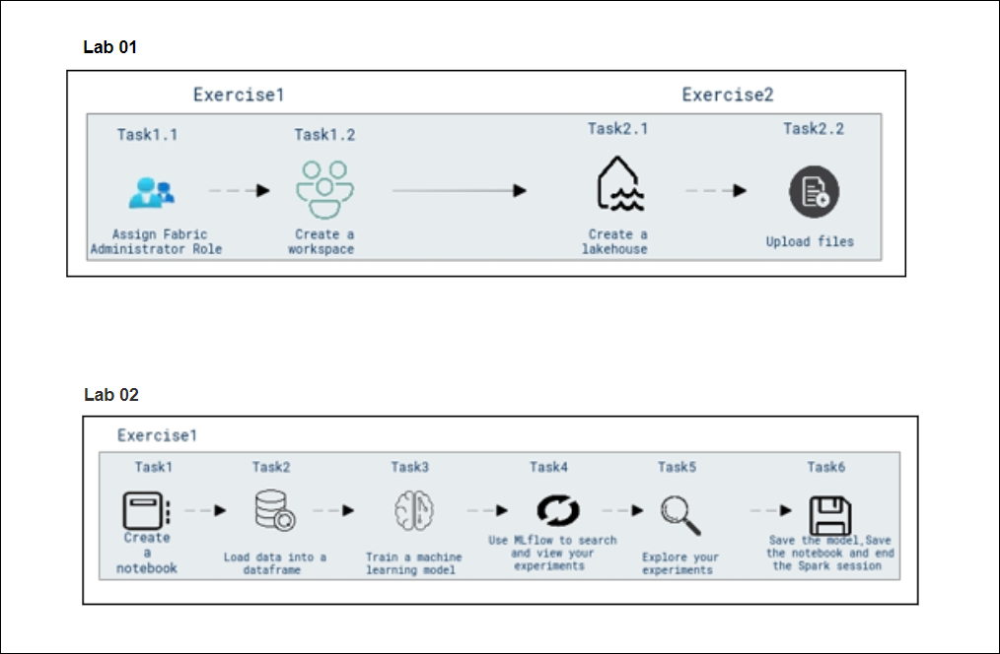

# **Cloud Scale Analytics with Microsoft Fabric**

### **Overall Estimated Duration**: 90 minutes  

## **Overview**  
In these labs, you will explore the fundamentals of Microsoft Fabric by first setting up a workspace and managing data using a Lakehouse for structured data storage and analysis. The second lab focuses on training machine learning models using notebooks, where you'll load data, train models, and track experiments. Throughout, you will gain hands-on experience with the tools and processes involved in both data management and machine learning within the Microsoft Fabric environment. These labs provide a comprehensive introduction to utilizing Microsoft Fabric for data processing and model development, preparing you to work with its key features in real-world applications.

## **Objective**  

**Getting Started with Microsoft Fabric:** you will set up a Microsoft Fabric workspace and assign administrative roles. The lab walks you through creating a Lakehouse for managing your data and uploading files for analysis. This foundational lab helps you understand the core features of data management in Microsoft Fabric. By the end, you'll be ready to work with structured data in this environment.

**Use Notebooks to Train a Model in Microsoft Fabric:** you will learn how to train a machine learning model using notebooks. The lab covers loading data, training a model, and tracking experiments with MLflow. You will save the trained model and notebook, gaining practical experience in model development. This lab provides hands-on exposure to machine learning within the Microsoft Fabric platform.

## **Prerequisites**

Participants should have:

- **Basic Understanding of Data Management:** Familiarity with data storage and management concepts, particularly in cloud environments.

- **Experience with Microsoft Fabric:** A general understanding of the Microsoft Fabric platform and its components, including workspaces and data lakes.

- **Proficiency in Power BI:** Basic knowledge of using Power BI to create and customize data visualizations.

- **Familiarity with Machine Learning Concepts:** Understanding of basic machine learning workflows, including data preprocessing, model training, and evaluation.

- **Basic Knowledge of Notebooks and Python:** Experience using notebooks, especially for data science and machine learning tasks, and familiarity with Python for coding.

## **Architecture**  

The architecture leverages Microsoft Fabric to enable seamless data management, machine learning, and collaborative analytics. The workspace serves as the central hub for managing resources, with the Fabric Administrator role granting appropriate access and permissions. A Lakehouse is created within the workspace to store structured and unstructured data, while the platform's data upload functionality facilitates the integration of external data files. Notebooks within the workspace are used for data exploration, manipulation, and training machine learning models. Data is loaded into dataframes for preprocessing, and machine learning models are trained and evaluated within the same environment. MLflow is utilized for tracking and managing experiments, ensuring efficient version control and comparison of different model iterations. This architecture supports scalable data processing, model training, and collaborative experimentation in the Microsoft cloud ecosystem.

### **Architecture Diagram**  
   
---

## **Explanation of Components**  

The architecture for this lab involves the following key components:

### **Lab 01 Components:**

**Create a Fabric Workspace:**  In Task 1.1, participants will assign the Fabric Administrator role, granting the necessary permissions to manage and configure resources within the Microsoft Fabric environment. Task 1.2 involves creating a Fabric workspace, which serves as a centralized hub for managing data, notebooks, and machine learning projects within the platform.

**Create a Lakehouse and Upload Files:**  Task 2.1 focuses on creating a Lakehouse within the workspace, which allows for the storage and management of both structured and unstructured data. Task 2.2 involves uploading data files into the Lakehouse, enabling participants to begin analyzing and processing their data in a unified environment.

### **Lab 02 Components:**

**Create a Notebook:** Participants will create an interactive notebook, providing a flexible environment for running code, visualizing results, and documenting their work. The notebook will serve as the primary tool for data manipulation and machine learning in subsequent tasks.

**Load Data into a DataFrame:** In this task, participants will load data into a DataFrame, a key structure in data analysis and machine learning that allows for efficient data manipulation and processing. This step prepares the data for model training and analysis.

**Train a Machine Learning Model:** Participants will train a machine learning model using the data loaded in the previous step. The task involves selecting an appropriate algorithm and training the model to make predictions based on the provided dataset.

**Use MLflow to Search and View Experiments:**  MLflow will be used to track the participants’ experiments, enabling them to search for and view details about various model runs, such as parameters, metrics, and results. This helps in managing and comparing different model versions.

**Explore Your Experiments:**  Participants will explore their machine learning experiments, reviewing the metrics and performance of different models to assess their effectiveness. This step allows for in-depth analysis and fine-tuning of the model.

**Save the Model, Save the Notebook, and End the Spark Session:**  In the final task, participants will save the trained machine learning model for future use, preserve their notebook with all steps and results, and properly terminate the Spark session to ensure all resources are efficiently managed.

## Getting Started with the Lab 

Once you're ready to dive in, your virtual machine and lab guide will be right at your fingertips within your web browser.

 

## Virtual Machine & Lab Guide

In the integrated environment, the lab VM serves as the designated workspace, while the lab guide is accessible on the right side of the screen.

**Note**: Kindly ensure that you are following the instructions carefully to ensure the lab runs smoothly and provides an optimal user experience.

## Exploring Your Lab Resources

To get a better understanding of your lab resources and credentials, navigate to the **Environment** tab.

   
## Utilizing the Split Window Feature
 
For convenience, you can open the lab guide in a separate window by selecting the **Split Window** button from the Top right corner.
 
 

## Lab Guide Zoom In/Zoom Out
 
To adjust the zoom level, select the **A↕ (1)** icon next to the timer, and then choose the required **zoom percentage (2)** from the dropdown.

  

## Managing Your Virtual Machine

Feel free to start, stop, or restart your virtual machine by selecting **More (1)**, choosing **Resources (2)**, and using the available **VM actions (3)** to manage your lab environment as needed.

  
## Let's Get Started with Azure Portal

1. On your virtual machine, click on the Azure Portal icon as shown below:

   
   
1. You'll see the **Sign into Microsoft Azure** tab. Here, enter your credentials:
 
   - **Email (1):** <inject key="AzureAdUserEmail"></inject>

   - click **Next (2)**.
 
      
 
1. Next, provide your **Enter Temporary Access Pass**:
 
   - **Password (1):** <inject key="AzureAdUserPassword"></inject>

   - click **Sign in (2)**.
 
      

1. If **Action Required** window pop up click on **Ask later**.
 
1. If prompted to stay signed in, you can click "No."

1. If you see the pop-up **Sign in to sync data**, Click on **No,thanks.** 

1. If you see the pop-up **You have free Azure Advisor recommendations!**, close the window to continue the lab.

1. If a **Welcome to Microsoft Azure** popup window appears, click **Cancel** to skip the tour.

## Support Contact
 
The CloudLabs support team is available 24/7, 365 days a year, via email and live chat to ensure seamless assistance at any time. We offer dedicated support channels tailored specifically for both learners and instructors, ensuring that all your needs are promptly and efficiently addressed.

Learner Support Contacts:
- Email Support: cloudlabs-support@spektrasystems.com
- Live Chat Support: https://cloudlabs.ai/labs-support

Now, click on **Next** from the lower right corner to move on to the next page. 

 

### Happy Learning!!