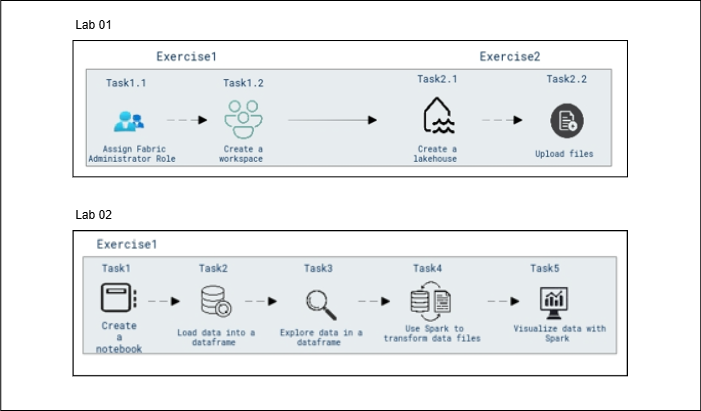

# Cloud Scale Analytics with Microsoft Fabric

### Overall Estimated Duration : **1 hour 30 Minutes**

## Overview

Microsoft Fabric is a unified data platform that combines data engineering, data warehousing, and business intelligence tools into a cohesive environment. By leveraging Microsoft Fabric, organizations can effectively manage, analyze, and visualize large datasets, enabling powerful data-driven decision-making processes.

In this hands-on lab, you will explore and set up Microsoft Fabric by creating a workspace and assigning the Fabric Administrator role. You will then create a Lakehouse to centralize and manage data, followed by uploading files for analysis. Additionally, you will leverage Apache Spark within Microsoft Fabric to load, explore, and transform data, performing operations such as filtering, aggregating, and summarizing. You will also save the transformed data in Parquet format, partition it, and visualize insights through Spark, gaining practical experience in data analysis and visualization within the platform.

## Objective

Learn to leverage Microsoft Fabric for workspace management, use Apache Spark for analyzing and transforming large datasets, and perform advanced data manipulation. 

- **Getting Started with Microsoft Fabric:** Learn how to create and manage a workspace in Microsoft Fabric by assigning the Fabric Administrator role, setting up a new workspace for data and analytics projects, and organizing your work effectively. Additionally, gain hands-on experience in setting up a Lakehouse within the workspace and uploading data files (e.g., CSV) to the Lakehouse, laying the foundation for future data analysis and processing.

- **Analyze Data with Apache Spark:** Use Apache Spark to analyze large datasets and perform data transformations. Participants will learn how to process and analyze large volumes of data efficiently, apply data transformations, clean and structure data, and perform aggregations using Spark. The lab will also cover creating and querying a Delta table for advanced data manipulation.

## Prerequisites

Participants should have:

- **Basic Knowledge of Microsoft Azure**: Familiarity with the Azure portal and the process of role assignments within Azure Active Directory (Entra ID).
- **Understanding of Workspace Creation**: Familiarity with the concept of workspaces in cloud platforms and how to create and configure them.
- **Basic Knowledge of Cloud Data Storage**: Understanding the concept of Lakehouses for organizing and storing data in cloud environments.
- **Basic File Management Skills**: Ability to upload files into a cloud-based data platform like Microsoft Fabric for further analysis.
- **Basic Knowledge of Apache Spark**: Familiarity with the fundamentals of Apache Spark, including its data processing capabilities and how to use it for large-scale data analysis.
- **Experience with Microsoft Fabric**: Understanding the Microsoft Fabric environment, including navigating the interface and using its notebooks for data analysis.
- **Basic Python Programming Skills**: Ability to write and modify Python code, particularly for using PySpark within notebooks.
- **Familiarity with DataFrame Operations in Spark**: Knowledge of DataFrame operations in Spark, including loading data, filtering, transforming, and performing aggregations.
- **Experience with Data File Formats**: Familiarity with data file formats such as CSV and Parquet, and how to load, save, and partition data using Spark.
- **Basic SQL Knowledge**: Understanding SQL queries for data manipulation and querying within Spark SQL, including grouping and aggregating data.

## Architecture

The architecture leverages Microsoft Fabric to streamline data management and analysis, integrating workspaces, lakehouses, notebooks, and reporting tools. The first lab focuses on the foundational setup, starting with assigning the Fabric Administrator Role to ensure proper permissions and access control. The workspace is then created, acting as the central environment for organizing and collaborating on data tasks. Following this, a lakehouse is established for data storage, and files are uploaded, populating the lakehouse with datasets for analysis. The second lab builds upon this setup by introducing a notebook for data exploration, where data is loaded into a dataframe, explored for insights, and transformed using Spark. The lab culminates with visualizations created using Spark to help communicate the results. This flow ensures a smooth progression from workspace and data storage setup to hands-on data exploration and reporting, empowering users with efficient tools for actionable insights.

## Architecture Diagram 

## Explanation of Components

The architecture for this lab involves the following key components:

### Lab 01 Components:

- **Fabric Administrator Role:** Ensures that the necessary permissions are granted to manage the workspace effectively, enabling access control and administrative capabilities.

- **Workspace:** A central environment where data and resources are managed. The workspace acts as the foundation for organizing and collaborating on data storage and analysis tasks.

- **Lakehouse:** A data storage solution designed for structured and unstructured data. The Lakehouse enables efficient data organization and facilitates analysis tasks.

- **Data Ingestion Tools:** Enables uploading of files into the Lakehouse to populate datasets required for analysis and querying.

### Lab 02 Components:

- **Notebook Environment:** The Notebook Environment serves as an interactive workspace for writing and executing code, providing a user-friendly interface for developing, running, and debugging data workflows efficiently.  

- **DataFrame for Data Loading:** Data is imported from various sources, such as CSV files, databases, or JSON, and structured into a DataFrame, enabling efficient storage, manipulation, and analysis of the data.  

- **Data Exploration:** Data exploration allows for in-depth analysis and visualization within the DataFrame, supporting operations such as querying, filtering, and summarizing data to uncover insights and patterns.  

- **Apache Spark for Data Transformation:** Apache Spark leverages its distributed processing capabilities to handle large datasets effectively, facilitating complex operations like filtering, joining, and aggregating data at scale.  

- **Data Visualization with Spark:** Data visualization with Spark utilizes built-in libraries or third-party tools to represent insights through intuitive charts, graphs, and dashboards, ensuring clear communication of data findings.  

## Getting Started with the Lab 

Once you're ready to dive in, your virtual machine and lab guide will be right at your fingertips within your web browser.

 

## Virtual Machine & Lab Guide

In the integrated environment, the lab VM serves as the designated workspace, while the lab guide is accessible on the right side of the screen.

**Note**: Kindly ensure that you are following the instructions carefully to ensure the lab runs smoothly and provides an optimal user experience.

## Exploring Your Lab Resources

To get a better understanding of your lab resources and credentials, navigate to the **Environment** tab.

   
## Utilizing the Split Window Feature
 
For convenience, you can open the lab guide in a separate window by selecting the **Split Window** button from the Top right corner.
 
 

## Lab Guide Zoom In/Zoom Out
 
To adjust the zoom level, select the **A↕ (1)** icon next to the timer, and then choose the required **zoom percentage (2)** from the dropdown.

  

## Managing Your Virtual Machine

Feel free to start, stop, or restart your virtual machine by selecting **More (1)**, choosing **Resources (2)**, and using the available **VM actions (3)** to manage your lab environment as needed.

  
## Let's Get Started with Azure Portal

1. On your virtual machine, click on the Azure Portal icon as shown below:

   
   
1. You'll see the **Sign into Microsoft Azure** tab. Here, enter your credentials:
 
   - **Email (1):** <inject key="AzureAdUserEmail"></inject>

   - click **Next (2)**.
 
      
 
1. Next, provide your **Enter Temporary Access Pass**:
 
   - **Password (1):** <inject key="AzureAdUserPassword"></inject>

   - click **Sign in (2)**.
 
      

1. If **Action Required** window pop up click on **Ask later**.
 
1. If prompted to stay signed in, you can click "No."

1. If you see the pop-up **Sign in to sync data**, Click on **No,thanks.** 

1. If you see the pop-up **You have free Azure Advisor recommendations!**, close the window to continue the lab.

1. If a **Welcome to Microsoft Azure** popup window appears, click **Cancel** to skip the tour.

## Support Contact
 
The CloudLabs support team is available 24/7, 365 days a year, via email and live chat to ensure seamless assistance at any time. We offer dedicated support channels tailored specifically for both learners and instructors, ensuring that all your needs are promptly and efficiently addressed.

Learner Support Contacts:
- Email Support: cloudlabs-support@spektrasystems.com
- Live Chat Support: https://cloudlabs.ai/labs-support

Now, click on **Next** from the lower right corner to move on to the next page. 

 

### Happy Learning!!