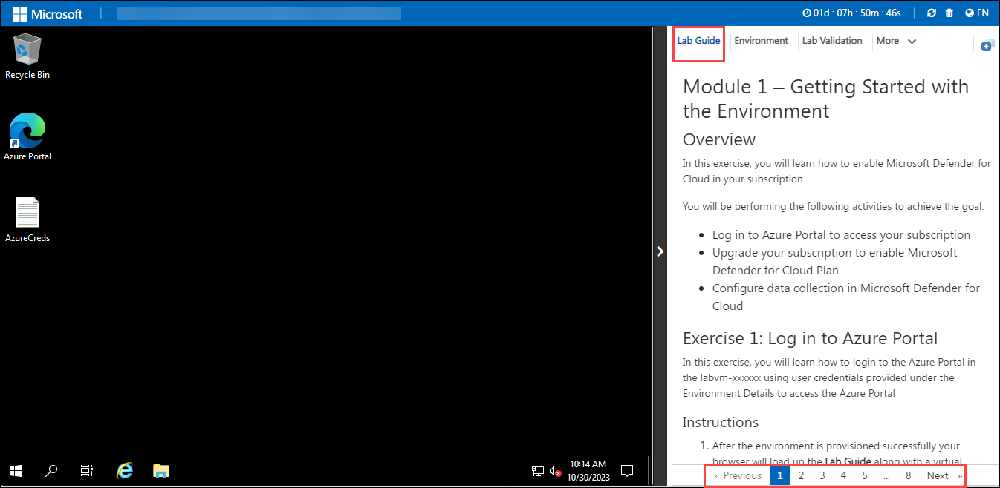
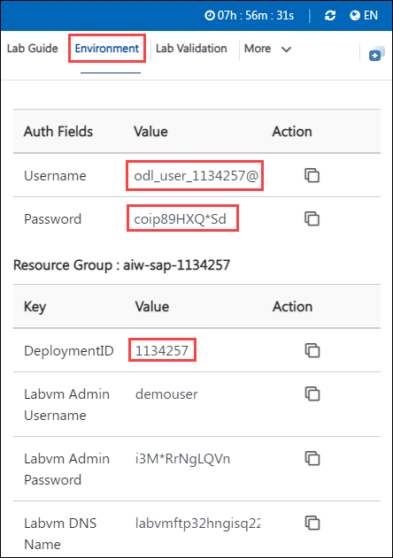

# Getting Started with Your ms-learn fabric Workshop
 
Welcome to your ms-learn fabric workshop! We've prepared a seamless environment for you to familiarize yourself with Microsoft Fabric, how it works and identify how you can use it for your analytics needs. Let's begin by making the most of this experience:
 
## Accessing Your Lab Environment
 
Once you're ready to dive in, your virtual machine and lab guide will be right at your fingertips within your web browser.
 
   

### Virtual Machine & Lab Guide
 
Your virtual machine is your workhorse throughout the workshop. The lab guide is your roadmap to success.
 
## Exploring Your Lab Resources
 
To get a better understanding of your lab resources and credentials, navigate to the **Environment Details** tab.
 
   
 
## Utilizing the Split Window Feature
 
For convenience, you can open the lab guide in a separate window by selecting the **Split Window** button from the Top right corner.
 
   
   
## Managing Your Virtual Machine
 
Feel free to start, stop, or restart your virtual machine as needed from the **Resources** tab. Your experience is in your hands!
 
   
 
## Let's Get Started with Azure Portal
 
1. On your virtual machine, click on the Azure Portal icon as shown below:
 
    

1. On **Sign into Microsoft Azure** tab you will see login screen, in that enter following email/username and then click on **Next**. 
   * Email/Username: <inject key="AzureAdUserEmail"></inject>
   
     
     
1. Now enter the following password and click on **Sign in**.
   * Password: <inject key="AzureAdUserPassword"></inject>
   
     
     
   > If you see the **Help us protect your account** dialog box, then select **Skip for now** option.

      
  
1. If you see the pop-up **Stay Signed in?**, click No

1. If you see the pop-up **You have free Azure Advisor recommendations!**, close the window to continue the lab.

1. If a **Welcome to Microsoft Azure** popup window appears, click **Maybe Later** to skip the tour.
      
1. Now, click on the **Next** from lower right corner to move on next page.

 
Now you're all set to explore the powerful world of technology. Feel free to reach out if you have any questions along the way. Enjoy your workshop!
