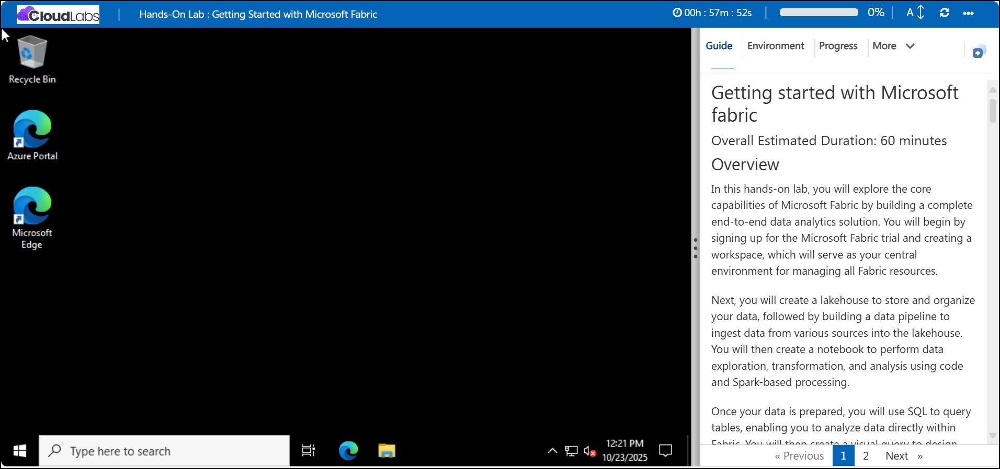
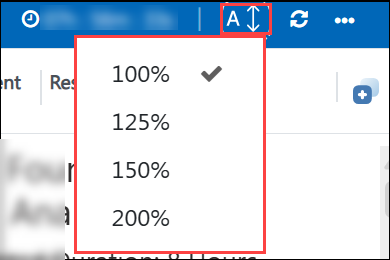
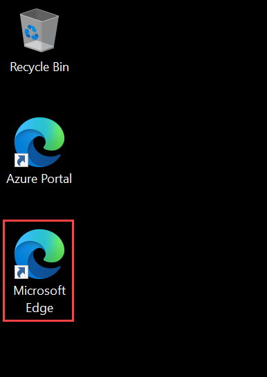
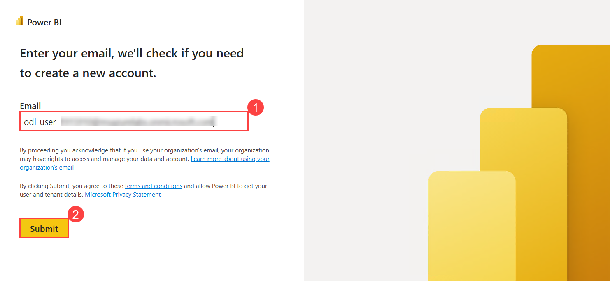
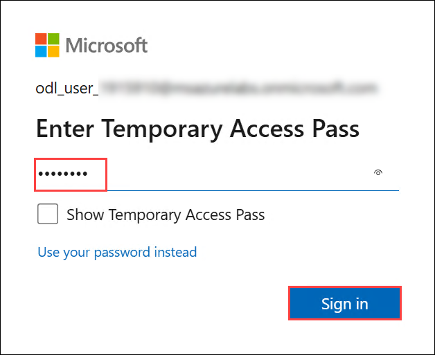
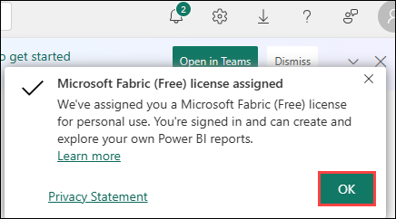
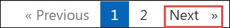

# Getting started with Microsoft fabric

### Overall Estimated Duration: 60 minutes

## Overview

In this hands-on lab, you will explore the core capabilities of Microsoft Fabric by building a complete end-to-end data analytics solution. You will begin by signing up for the Microsoft Fabric trial and creating a workspace, which will serve as your central environment for managing all Fabric resources.

Next, you will create a lakehouse to store and organize your data, followed by building a data pipeline to ingest data from various sources into the lakehouse. You will then create a notebook to perform data exploration, transformation, and analysis using code and Spark-based processing.

Once your data is prepared, you will use SQL to query tables, enabling you to analyze data directly within Fabric. You will then create a visual query to design and execute data transformations using an intuitive, no-code interface. Finally, you will build a report to visualize your insights and share them with stakeholders.

By the end of this lab, you will have hands-on experience with the key components of Microsoft Fabric—from data ingestion and transformation to analysis and reporting—gaining a solid understanding of how to create a unified, end-to-end analytics solution in the cloud.

## Objective

This lab aims to provide hands-on experience with Microsoft Fabric, enabling users to create a workspace, ingest and transform data, and analyze it using notebooks and SQL. Users will learn to build end-to-end data pipelines, visual queries, and reports. By the end, participants will be able to manage, analyze, and visualize data effectively in a unified analytics environment.

1. **Create a Fabric workspace:** Set up a centralized environment in Microsoft Fabric to manage and collaborate on data projects. Participants will establish a centralized platform for managing and collaborating on data projects.

1. **Ingest data with a pipeline in Microsoft Fabric:** Use data pipelines to import and prepare data for analysis within Microsoft Fabric. Participants will automate the import and preparation of data for subsequent analysis.

Participants should have:

- Basic understanding of data concepts such as tables, queries, and reports.
- Understanding of SQL and relational database concepts, and familiarity with data warehousing solutions.

## Getting Started with the Lab
 
Welcome to your Microsoft Fabric workshop! We've prepared a seamless environment for you to explore and learn about Azure services. Let's begin by making the most of this experience:
 
## Accessing Your Lab Environment
 
Once you're ready to dive in, your virtual machine and **Guide** will be right at your fingertips within your web browser.

   

## Virtual Machine & Lab Guide

Your virtual machine is your workhorse throughout the workshop. The lab guide is your roadmap to success.

## Exploring your Lab Resources

To get the lab environment details, you can select the **Environment** tab. Additionally, the credentials will also be emailed to your registered email address.

   

## Utilizing the Split Window Feature

Utilizing the Split Window Feature: For convenience, you can open the lab guide in a separate window by selecting the **Split Window** button from the top right corner.

   

## Managing Your Virtual Machine
 
Feel free to **Start, Stop, or Restart** your virtual machine as needed from the **Resources** tab. Your experience is in your hands!

   

## Lab Guide Zoom In/Zoom Out Options

To adjust the zoom level for the environment page, click the A↕ : 100% icon located next to the timer in the lab environment.

   

## Let's Get Started with Power BI Portal

1. In the Lab VM, click on the **Microsoft Edge** browser, which is available on the desktop.

   

1. Copy the **Power BI link** below and open this link in a new tab on the Microsoft Edge Browser.

   ```
   https://powerbi.com
   ```
   
1. On the **Enter your email, we'll check if you need to create a new account** tab, you will see the login screen, in that enter the following email/username, and click on **Submit (2)**.
 
   - **Email/Username:** <inject key="AzureAdUserEmail"></inject> **(1)**

     
     
1. Now enter the following password and click on **Sign in**.
 
   - **Password:** <inject key="AzureAdUserPassword"></inject> 

      
     
1. If you see a pop-up **Stay Signed in?**, click **No**.

   

1. You will be navigated to the Power BI Home page.

   

1. On the **Microsoft Fabric (Free) license assigned** dialog box, click **OK (1)** to confirm the license assignment.  

   

## Support Contact

The CloudLabs support team is available 24/7, 365 days a year, via email and live chat to ensure seamless assistance at any time. We offer dedicated support channels tailored specifically for both learners and instructors, ensuring that all your needs are promptly and efficiently addressed.

Learner Support Contacts:

- Email Support: cloudlabs-support@spektrasystems.com
- Live Chat Support: https://cloudlabs.ai/labs-support

Now, click on **Next** from the lower right corner to move on to the next page.
   
   

## Happy Learning!!
